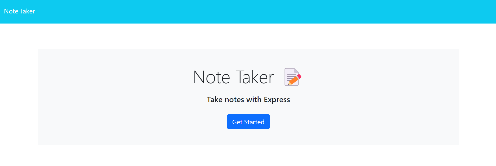
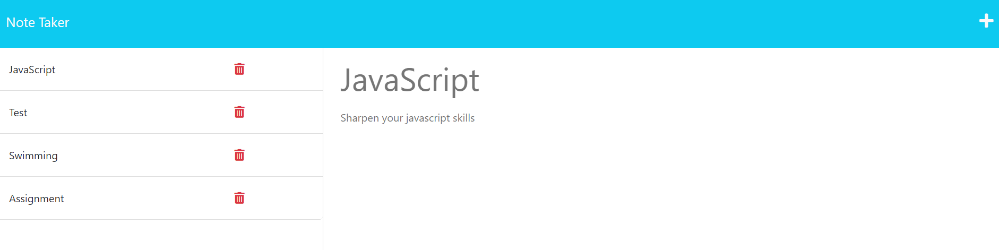

# note-taker 📝


## Description 📄

I have developed an effective note-taking program that enables users to easily store and access their notes. In order to receive, post, and delete data from a dynamically updated JSON file, this application uses an Express.js backend, which is at the heart of its functionality. In order to ensure effective communication between the user interface and the server, the application's frontend and backend are securely connected. Users of this cutting-edge system may take notes with ease and clarity, increasing their productivity and organizational skills.

## Table of Contents

* [Installation](#installation) 🛠️
* [Usage](#usage) 📘
* [Contributing](#contributing) 🤝
* [Tests](#tests) 🧪
* [License](#license) 📜
* [Credits](#credits) 🙏
* [Questions](#questions) ❓
* [Deployed Application](#link) 🚀

## <a name="installation"></a>Installation 🛠️

To install the necessary dependencies, run the following command:

```
npm i
npm install express@4.16.4
npm install shortid@2.2.16
```

## <a name="usage"></a>Usage 📘

Users
- Can click on the link, type in the title and text field, and save their notes from the top right button.
- Can also delete their notes.

Developers
- Must install visual studio code for development.
- NodeJS is used to create the backend of this application.
- ExpressJS dependency is used to create the server side and shortid dependency is used to give unique ID to saved notes in JSON file.

Following is the screenshot of the application. 📷





## <a name="contributing"></a>Contribution 🤝

The usability of the app could be enhanced by new features that developers can create and install. For instance, they might include tools for categorizing notes, enhancing search capabilities, or enabling note-related reminders.

## <a name="tests"></a>Tests 🧪

To run tests, run the following command:

```
node server.js
```

## <a name="license"></a>License 📜

This project is licensed under The MIT License. Here is the link to the license to access more information for your reference: [https://opensource.org/licenses/MIT](https://opensource.org/licenses/MIT)

## <a name="credits"></a>Credits 🙏

I utilized the study material provided by the institution as a reference to complete my application.

Following are the documents I used to help me write code:

- [Heroku documentation on getting started with Node.js](https://devcenter.heroku.com/articles/getting-started-with-nodejs?singlepage=true)
- [Heroku documentation on creating a Heroku remote](https://devcenter.heroku.com/articles/git#creating-a-heroku-remote)
- [Express.js documentation on express.Router](http://expressjs.com/en/guide/routing.html#express-router)
- [MDN Web Docs on using Fetch](https://developer.mozilla.org/en-US/docs/Web/API/Fetch_API/Using_Fetch)
- [Express.js documentation on req.body](http://expressjs.com/en/api.html#req.body)
- [Express.js documentation on serving static files](http://expressjs.com/en/starter/static-files.html)
- [Express.js documentation on query parameters](http://expressjs.com/en/guide/routing.html#route-paths)

## <a name="questions"></a>Questions ❓

If you have further questions, you are welcome to reach me through my email at hazkeel27@gmail.com.

You can view my projects by going through my GitHub profile at [https://github.com/hazkeel27](https://github.com/hazkeel27).

## <a name="link"></a>Deployed Application 🚀

